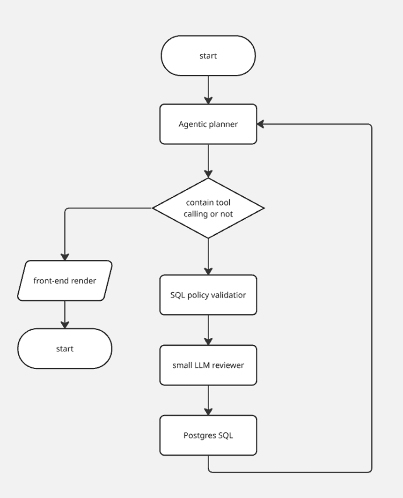
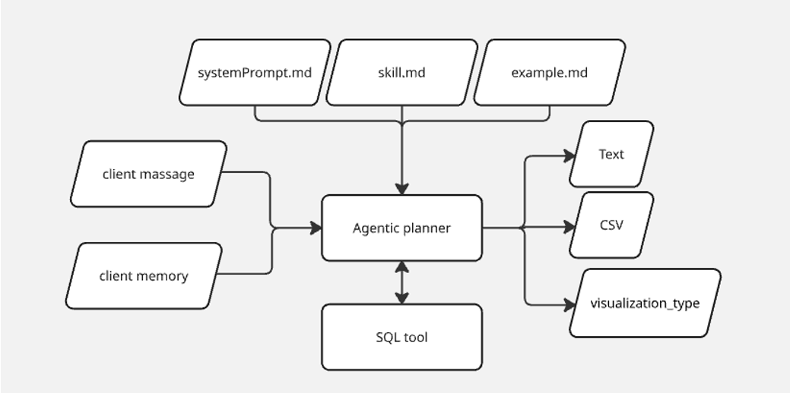

# Agentic Analytics Assistant — System Design & Pseudocode

This repository is a **conceptual prototype of an agentic analytics assistant** designed to answer business questions using natural language and SQL.

The purpose of this project is to demonstrate how I approach **AI solution design**, especially around agentic tool calling, database safety, cost, latency, and user experience.

The implementation is intentionally written as pseudocode. The focus is on the architecture and design decisions rather than production-ready application code.

---

## Business Assumptions

Before designing the system, I made three assumptions about the business requirements.

### 1. Conversations are mostly short

Most analytical conversations are expected to be short, so the system uses a **short conversation window** rather than long-term memory.

This keeps the architecture simple and avoids unnecessary complexity.

### 2. Cost and latency matter

The assistant is designed for interactive use, so LLM usage and database operations should be controlled.

The system limits:

* Context size
* SQL retries
* Tool calls
* Query execution time
* Result size passed to the LLM

### 3. Users may work with sensitive business data

The database may contain information such as customer email, purchase history, or transaction data.

The design assumes that authenticated users may be authorized to analyze this information, while access control and database permissions remain enforced outside of the LLM.

---

## System Architecture

The system follows a **ReAct-style agentic workflow**.

The user sends a message through the chat interface together with a short conversation history.

The request is sent to an **Agentic Planner**, which decides whether it should:

* Answer directly
* Ask the user for clarification
* Call the SQL tool



The planner is initialized with instructions such as:

* `systemPrompt.md`
* `skill.md`
* `example.md`

These define the agent's behavior, available tools, accessible data, and examples of supported requests.

The planner currently has one external capability: the **SQL Tool**.



---

## SQL Tool Calling Flow

When database access is required, the planner generates SQL and sends it through multiple validation layers before execution.

```text
User Request
     ↓
Agentic Planner
     ↓
Generate SQL
     ↓
SQL Policy Validator
     ↓
Small LLM Reviewer
     ↓
PostgreSQL
     ↓
Result
     ↓
Agentic Planner
     ↓
Frontend
```

The **SQL Policy Validator** handles deterministic rules such as:

* Read-only queries
* Approved tables and columns
* Blocked SQL operations
* Query limits
* Unauthorized query patterns

A **small LLM reviewer** provides an additional semantic check to verify that the generated query actually matches the user's request and does not retrieve unnecessary information.

PostgreSQL provides another security boundary through:

* Least-privilege read-only access
* Query timeouts
* Restricted tables / views
* Result limits

The LLM is therefore not treated as the final security boundary.

---

## Result Handling

Large database results are not passed directly into the LLM context.

The full result can remain available to the application, while the planner receives only a small representative sample, such as the first **10–20 rows**, together with summary information.

This reduces token usage and prevents unnecessary data from filling the model context.

If the planner needs more information, it can call the SQL tool again as part of the agent loop.

---

## Frontend Response

The backend returns a simple structured response.

For a normal conversation or clarification:

```json
{
  "text": "Which time period would you like to analyze?"
}
```

For an analytical result:

```json
{
  "text": "Product A generated more revenue than Product B in most months.",
  "data": "...CSV...",
  "visualization_type": "line_chart"
}
```

The planner selects the visualization based on the user's request and the shape of the result.

For example:

* `line_chart` — time-series data
* `bar_chart` — category comparison
* `kpi` — single metric
* `table` — detailed records

The frontend simply renders the response according to the provided `visualization_type`.

---

## Handling Ambiguous Requests

The planner should not generate SQL if there is not enough information to understand the user's intent.

For example:

> Show me everything.

Instead of guessing what the user means, the planner should ask for more information such as:

* What metric?
* Which dimension?
* What time period?

Once enough information is available, the request goes through the same agent loop again.

---

## Production Considerations

Although this repository focuses on pseudocode, the architecture also considers several production concerns.

**Security**

* Deterministic SQL validation
* Read-only database access
* Least privilege
* Query timeout and result limits

**Cost**

* Limited agent iterations
* Limited SQL retries
* Small result previews
* Controlled LLM context size

**Latency**

* Server-Sent Events (SSE) for progress updates
* Database indexing
* Query optimization

**Caching**

* Short-TTL cache for successful queries
* Cache based on normalized SQL and authorization scope

**Monitoring**

* Request latency
* Token usage
* SQL execution time
* Tool calls
* Validation failures
* Cache hits
* Errors

---

## Goal of This Repository

This project is not intended to demonstrate a finished production application.

It is a **system-design and pseudocode exercise** showing how I would approach an LLM-powered analytics product from:

**Business Requirements → Agent Design → Tool Calling → Security → Database → User Experience**

The main design principle is:

> **The LLM can decide what it wants to do, but deterministic systems decide what it is allowed to do.**

